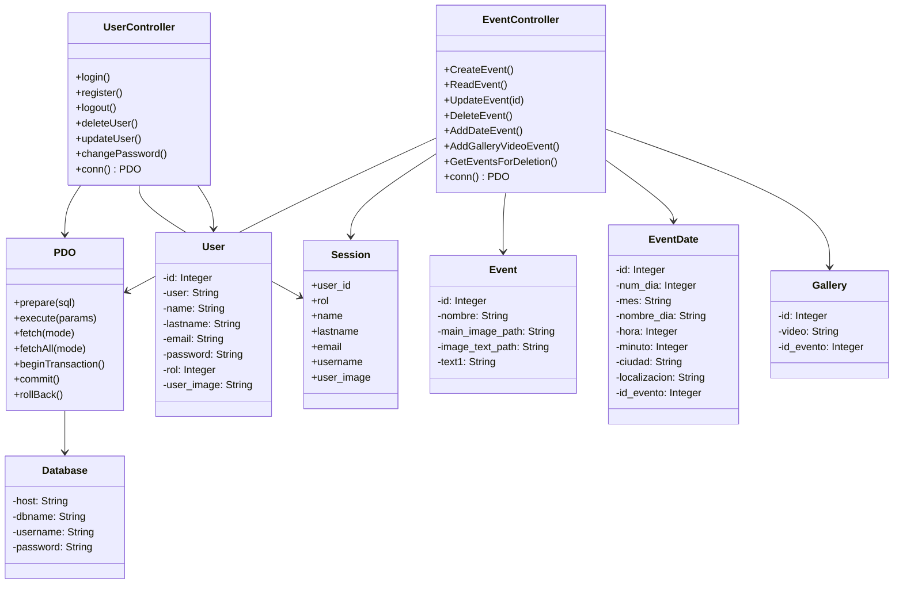
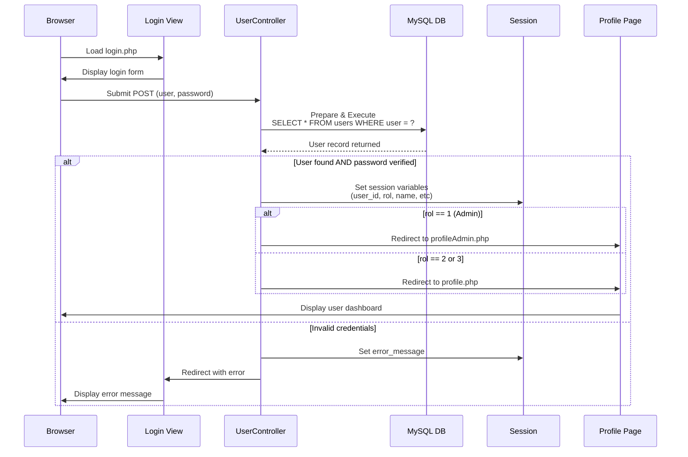
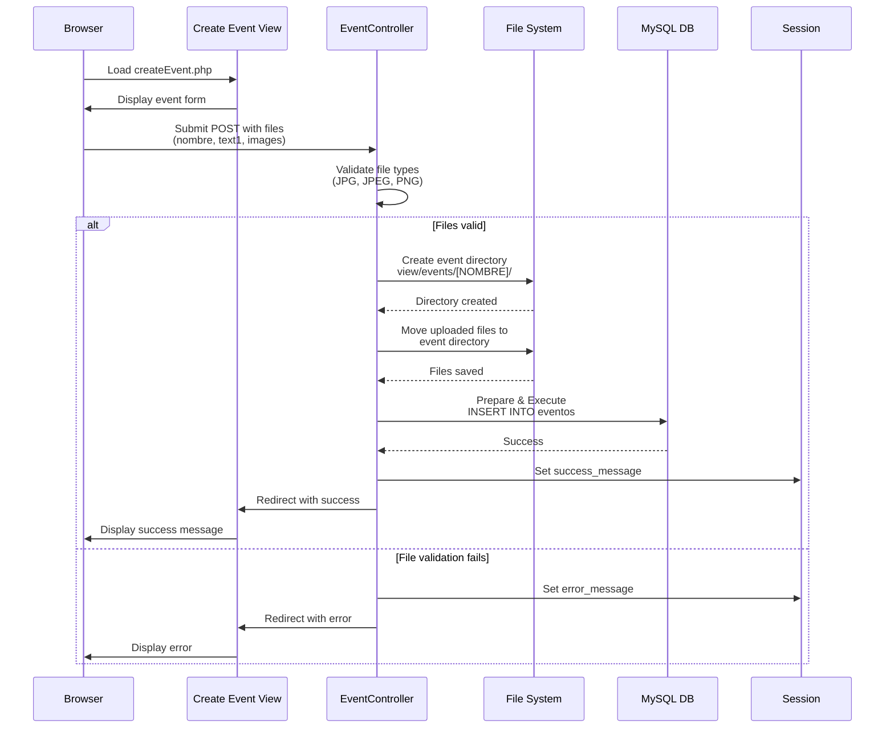
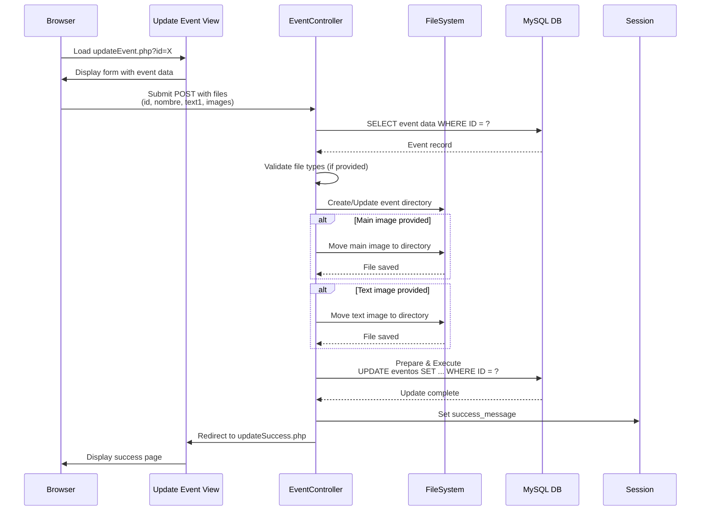
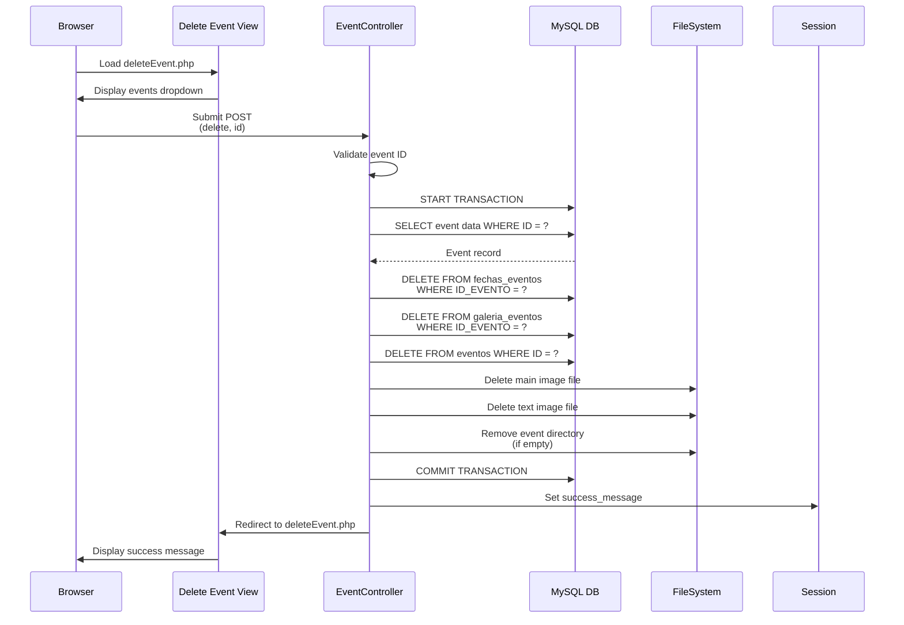

# Firalia - Event Management System

## Overview
Firalia is a web-based event management system built with PHP and MySQL. It allows users to create, read, update, and delete events, manage user profiles, and handle event dates and galleries. The system supports different user roles (Admin, Event Manager, User) with role-based access control.

## Technology Stack
- **Backend**: PHP 7.4+
- **Database**: MySQL with PDO
- **Frontend**: HTML5, CSS3, JavaScript (Swiper.js)
- **Server**: Apache (XAMPP)
- **Email**: PHPMailer

## Project Structure
```
MP0487_RA5RA6_Firalia/
├── controller/          # Business logic and controllers
├── view/               # Frontend templates and assets
│   ├── CSS/           # Stylesheets
│   ├── JS/            # JavaScript files
│   ├── events/        # Event media storage
│   └── images/        # User profile images
├── model/             # Database schema
└── XML/               # XML and XSL transformation files
```

## Class Architecture

### Class Diagram



---

## User Authentication Flow

### Login Sequence Diagram



---

## Event Management Flow

### Create Event Sequence Diagram



---

### Update Event Sequence Diagram



---

### Delete Event Sequence Diagram



---

## Database Schema

### Users Table
- `ID` (INT, PRIMARY KEY)
- `USER` (VARCHAR)
- `NAME` (VARCHAR)
- `LASTNAME` (VARCHAR)
- `EMAIL` (VARCHAR)
- `PASSWORD` (VARCHAR - hashed)
- `ROL` (INT) - 1: Admin, 2: Event Manager, 3: User
- `USER_IMAGE` (VARCHAR - path to image)

### Eventos Table
- `ID` (INT, PRIMARY KEY)
- `NOMBRE` (VARCHAR)
- `MAIN_IMAGE_PATH` (VARCHAR)
- `IMAGE_TEXT_PATH` (VARCHAR)
- `TEXT1` (TEXT)

### Fechas_Eventos Table (Event Dates)
- `ID` (INT, PRIMARY KEY)
- `NUM_DIA` (INT)
- `MES` (VARCHAR)
- `NOMBRE_DIA` (VARCHAR)
- `HORA` (INT)
- `MINUTO` (INT)
- `CIUDAD` (VARCHAR)
- `LOCALIZACION` (VARCHAR)
- `ID_EVENTO` (INT, FOREIGN KEY)

### Galeria_Eventos Table (Event Gallery)
- `ID` (INT, PRIMARY KEY)
- `VIDEO` (VARCHAR - URL)
- `ID_EVENTO` (INT, FOREIGN KEY)

---

## Key Features

### User Management
- **Registration**: Users can register with email validation and password hashing
- **Login**: Secure login with password verification
- **Password Change**: Users can update their password with validation
- **Profile Update**: Users can update their profile information
- **Account Deletion**: Users can delete their accounts

### Event Management (Admin/Event Manager)
- **Create Events**: Add new events with main image, text image, and description
- **Read Events**: View all events in the system
- **Update Events**: Modify event details and images
- **Delete Events**: Remove events and associated data (cascading delete)

### Event Details
- **Add Event Dates**: Schedule events with location and time information
- **Add Gallery Videos**: Add video links to event galleries
- **Image Management**: Upload and manage event promotional images

### Session Management
- User session data stored including user ID, role, name, email, and profile image
- Role-based redirects (Admin → profileAdmin.php, Users → profile.php)

---

## Security Features

- ✅ **Password Hashing**: Uses PHP `password_hash()` with PASSWORD_DEFAULT algorithm
- ✅ **SQL Injection Prevention**: Uses PDO prepared statements with parameterized queries
- ✅ **Input Sanitization**: `htmlspecialchars()` and `trim()` applied to user inputs
- ✅ **File Upload Validation**: 
  - File type validation (JPG, JPEG, PNG only)
  - File size limits enforced
  - Files saved outside web root where possible
- ✅ **Email Validation**: Uses `filter_var()` with FILTER_VALIDATE_EMAIL
- ✅ **Error Handling**: PDO exception handling with rollback on transaction failure

---

## Installation & Setup

### Prerequisites
- XAMPP or similar Apache/PHP/MySQL stack
- PHP 7.4 or higher
- MySQL 5.7 or higher

### Steps
1. Place project in `htdocs` folder
2. Import `model/db.sql` into MySQL
3. Update database credentials in:
   - `controller/databasePDO.php`
   - `controller/database.php`
4. Create necessary directories:
   - `view/events/`
   - `controller/images/`
5. Access via: `http://localhost/MP0487/MP0487_RA5RA6_Firalia/view/index.php`

---

## API Endpoints (Controller Actions)

### UserController
- `POST` - login: Authenticate user
- `POST` - register: Create new user account
- `POST` - logout: End user session
- `POST` - updateUser: Modify user profile
- `POST` - changePassword: Update password
- `POST` - deleteUser: Remove user account

### EventController
- `POST` - create: Add new event
- `POST` - read: Retrieve all events
- `POST` - update: Modify event details
- `POST` - delete: Remove event
- `POST` - date: Add event date/schedule
- `POST` - galleryVideo: Add video to event gallery

---

## Development Notes

- Both controllers use PDO for database operations
- Database connections are established per request (not persistent)
- Session variables are used for user context and messaging
- File operations include directory creation and cleanup
- Transaction support for complex operations (event deletion)
- Email functionality available via PHPMailer (see `enviarEmail.php`)

---

## Future Enhancements

- [ ] API REST endpoints
- [ ] User authentication tokens
- [ ] Event search and filtering
- [ ] Advanced permission system
- [ ] Event attendance tracking
- [ ] Email notifications
- [ ] Image optimization
- [ ] Pagination for event listing

---

## Authors & Contributors
Firalia Development Team - RA5/RA6 Project

---

## License
All rights reserved. Firalia © 2026
